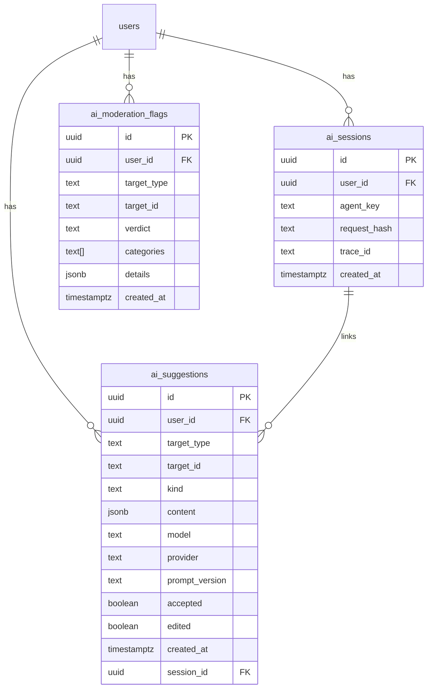

# AI Schema (Draft)

Este documento define las tablas propuestas para funcionalidades de IA en GoalShare. Es un borrador funcional para orientar futuras migraciones en Drizzle y decisiones de diseño. No se deben crear migraciones aún; primero validar este diseño.

## Objetivos

- **Trazabilidad y auditoría** de las sugerencias generadas por agentes.
- **Idempotencia y telemetría** a nivel de sesión/ejecución.
- **Moderación** pre/post generación para cumplimiento y seguridad.
- **Versionamiento** de prompts/modelos y medición de adopción (accepted/edited).

---

## Tablas

### 1) `ai_suggestions`

Registra salidas de los agentes para su auditoría, aceptación y mejora continua.

- `id` (uuid, pk)
- `user_id` (uuid, fk → `users.id` o equivalente en Supabase)
- `target_type` (text, enum lógico: `goal` | `milestone` | `post` | `comment`)
- `target_id` (uuid | text, id del recurso destino)
- `kind` (text, enum lógico: `milestones` | `smart` | `advice` | `plan`)
- `content` (jsonb, estructura tipada según DTO de cada endpoint)
- `model` (text, p.ej. `o4-mini`, `claude-3-5-sonnet`, `deepseek/deepseek-chat`)
- `provider` (text, p.ej. `openai` | `anthropic` | `openrouter`)
- `prompt_version` (text, versión de prompt utilizada)
- `accepted` (boolean, default false)
- `edited` (boolean, default false)
- `created_at` (timestamptz, default now())
- `session_id` (uuid, fk → `ai_sessions.id`, nullable)

Índices sugeridos:

- `idx_ai_suggestions_user_created_at` (user_id, created_at DESC)
- `idx_ai_suggestions_target` (target_type, target_id)
- `idx_ai_suggestions_kind` (kind)

Uso:

- Guardar el resultado generado antes de que el usuario lo acepte.
- Medir tasas de aceptación/edición por `prompt_version` y `model`.

---

### 2) `ai_sessions`

Representa una ejecución/orquestación de un agente (para idempotencia, cache y trazas).

- `id` (uuid, pk)
- `user_id` (uuid, fk → users)
- `agent_key` (text, enum lógico: `planner` | `smart` | `coach` | `scheduler` | `moderator`)
- `request_hash` (text, hash estable del input para cache/idempotency)
- `trace_id` (text, opcional, correlación con sistema de tracing)
- `created_at` (timestamptz, default now())

Índices sugeridos:

- `uniq_ai_sessions_request_hash` (unique)
- `idx_ai_sessions_user_created_at` (user_id, created_at DESC)

Uso:

- Evitar ejecuciones duplicadas.
- Auditar runs y correlacionar con logs externos.

---

### 3) `ai_moderation_flags`

Marca contenidos para revisión o bloqueo; puede aplicarse a entradas/salidas.

- `id` (uuid, pk)
- `user_id` (uuid, fk → users, opcional si el contenido no está ligado a usuario)
- `target_type` (text, `post` | `comment` | `goal` | `milestone` | `suggestion`)
- `target_id` (uuid | text)
- `verdict` (text, enum lógico: `allow` | `block` | `review`)
- `categories` (text[], categorías de incumplimiento o riesgo)
- `details` (jsonb, razones, extractos, puntuaciones)
- `created_at` (timestamptz, default now())

Índices sugeridos:

- `idx_ai_moderation_target` (target_type, target_id)
- `idx_ai_moderation_created_at` (created_at DESC)

Uso:

- Gatear publicación de posts/comentarios.
- Moderar sugerencias de IA antes de mostrarlas o persistirlas como definitivas.

---

## Relaciones



---

## Correspondencia con DTOs (resumen)

- `milestones` → `content.milestones: Milestone[]` (DTO de `/api/ai/milestones`).
- `smart` → `content: SmartResponse`.
- `advice` → `content: AdviceResponse`.
- `plan` → `content.schedule: DayBlock[]`.
- Moderación → flags vinculados a `target_type/target_id` o a `ai_suggestions` (cuando `target_type = 'suggestion'`).

---

## Estrategia de migración (cuando se apruebe)

1. Crear migraciones con Drizzle para las tres tablas, índices y FKs.
2. Actualizar `db/schema.ts` con los modelos Tipados.
3. Añadir repositorios ligeros para:
   - Insertar `ai_sessions` (con `request_hash`).
   - Insertar `ai_suggestions` (vinculadas a sesión si aplica).
   - Insertar `ai_moderation_flags`.
4. Añadir seeds opcionales mínimos para pruebas manuales.

---

## Privacidad y cumplimiento

- Evitar almacenar datos sensibles en `content`.
- Considerar redactar/anonimizar PII antes de persistir salidas.
- Mantener logs/trazas en conformidad con políticas de datos.

---

## Notas

- Este diseño permite **seguir siendo agnósticos del proveedor de LLM** y versionar prompts/modelos.
- `session_id` facilita correlación con caching, rate limit y tracing.
- `accepted`/`edited` abren la puerta a una **capa de calidad** (medir utilidad real de la IA).

---

## Guía para contribuidores: Proveedores y Modelos (Issue #50)

Esta guía explica cómo cambiar de proveedor/modelo y cómo preparar la adición de un proveedor nuevo, usando la configuración actual.

### 1) Cambiar proveedor/modelo (sin tocar código)

- **Archivo**: `.env`
- **Global** (aplica a agentes sin override por agente):
  - `AI_DEFAULT_PROVIDER` (valores válidos por contrato actual: `openai` | `anthropic` | `openrouter`)
  - `AI_DEFAULT_MODEL` (string del modelo, p.ej. `gpt-4o-mini`)
- **Por agente (solo agentes existentes)** en `.env`:
  - Planner: `AI_PROVIDER_PLANNER`, `AI_MODEL_PLANNER`
  - Smart: `AI_PROVIDER_SMART`, `AI_MODEL_SMART`
  - Coach: `AI_PROVIDER_COACH`, `AI_MODEL_COACH`
  - Scheduler: `AI_PROVIDER_SCHEDULER`, `AI_MODEL_SCHEDULER`
  - Moderator: `AI_PROVIDER_MODERATOR`, `AI_MODEL_MODERATOR`

Precedencia efectiva (ver `config/ai.ts`):

1. Overrides por agente (si existen) →
2. Overrides globales `AI_DEFAULT_*` →
3. `AI_DEFAULTS[agent]` o fallback seguro.

### 2) Cambiar defaults por agente (opcional, en código)

- **Archivo**: `config/ai.ts`
- Edita `AI_DEFAULTS` (es `Partial<Record<AgentKey, ModelConfig>>`).
- Útil para proponer valores por defecto adecuados a un agente específico.

### 3) Agregar un proveedor nuevo (conceptual)

Hoy el contrato de proveedores/modelos está definido en `lib/ai/contracts/model.ts`:

- `ProviderKey = "openai" | "anthropic" | "openrouter"`
- `ModelAdapter` y `ProviderFactory` describen cómo normalizar el acceso al modelo.

Pasos para soportar un nuevo proveedor (cuando se integre el registro de proveedores):

1. **Extender el contrato**: agrega el literal del proveedor en `ProviderKey`.
2. **Adapter**: crea un adapter que implemente `ModelAdapter` (p. ej., `lib/ai/providers/<proveedor>-adapter.ts`).
3. **Factory/Registry**: registra un `ProviderFactory` que cree el adapter a partir de `ModelConfig`.
4. **Resolver**: el `ModelResolver` seleccionará el `ProviderFactory` por `config.provider` y devolverá el `ModelAdapter` correcto.

Nota: Aún no existe un `ProviderRegistry` en el código; esta guía documenta el patrón a seguir. Cuando se implemente, se añadirá la ruta de archivo exacta y ejemplos.

### 4) Uso de Bun para instalaciones

- Este proyecto usa Bun. Para instalar SDKs o clientes oficiales:
  - `bun add <paquete>` (runtime)
  - `bun add -d <paquete>` (dev)
- Verifica la documentación más reciente del SDK antes de integrarlo.

### 5) Buenas prácticas

- No hardcodear API keys; usar variables de entorno.
- Mantener `ProviderKey` y `ModelConfig` sincronizados con lo soportado.
- Preferir defaults en `config/ai.ts` y overrides en `.env` para evitar cambios de código.

## Cómo agregar un nuevo agente (proceso mínimo)

Con la refactorización reciente, agregar un nuevo agente requiere un único cambio en código. El resto se resuelve automáticamente por configuración.

### 1) Agregar la clave del agente

- **Archivo**: `lib/ai/contracts/agent.ts`
- **Acción**: Agrega la nueva clave al array fuente de verdad `AGENT_KEYS`.

```ts
export const AGENT_KEYS = [
  "planner",
  "smart",
  "coach",
  "scheduler",
  "moderator",
  // Agrega aquí tu nuevo agente, p.ej. "reviewer"
  "reviewer",
] as const;
```

Eso es todo lo necesario para que:

- El tipo `AgentKey` incluya la nueva clave.
- El `agentRegistry` la soporte automáticamente (pre-registro iterando `AGENT_KEYS`).
- `AI_CONFIG` genere configuración efectiva para el nuevo agente (usa defaults globales si no hay específicos).

### 2) Defaults y overrides (opcional)

- **Archivo**: `config/ai.ts`
  - `AI_DEFAULTS` es `Partial<Record<AgentKey, ModelConfig>>`.
  - Si quieres defaults específicos para el nuevo agente, añade una entrada (opcional). Si no existe, caerá en los globales.
- **Archivo**: `.env`
  - Se mantienen solo overrides por agente para los agentes existentes actuales (planner, smart, coach, scheduler, moderator).
  - Para agentes nuevos, utiliza los globales:
    - `AI_DEFAULT_PROVIDER`
    - `AI_DEFAULT_MODEL`

### 3) Endpoint y DTOs (opcionales)

- Si el agente tendrá endpoint HTTP:
  - **DTOs**: agrega schemas en `lib/ai/contracts/dto.ts`.
  - **Ruta**: crea `app/api/ai/<agent>/route.ts` siguiendo el patrón de las existentes (valida DTO, llama `AgentFactory.create('<agent>')`).

### 4) Modelo/proveedor efectivo

- `AI_CONFIG` se construye iterando `AGENT_KEYS` y aplicando la precedencia:
  1. Overrides por agente (solo para agentes existentes actuales).
  2. Overrides globales (`AI_DEFAULT_PROVIDER`, `AI_DEFAULT_MODEL`).
  3. `AI_DEFAULTS[agent]` si existe; de lo contrario, un fallback seguro (OpenAI + `gpt-4o-mini`, `temperature` 0.2).

### 5) Ejemplo de uso

```ts
import { AgentFactory } from "@/lib/ai";

const agent = AgentFactory.create("reviewer");
const result = await agent.execute({
  /* payload */
});
// Por defecto devuelve un stub NotImplemented hasta conectar el SDK/lógica real.
```

### 6) Resumen

- Para agregar un agente, edita solo `AGENT_KEYS`.
- Config efectiva se resuelve sin cambios adicionales (AI_CONFIG + defaults globales).
- Overrides por agente se mantienen únicamente para los agentes existentes; los nuevos heredan de los globales.
