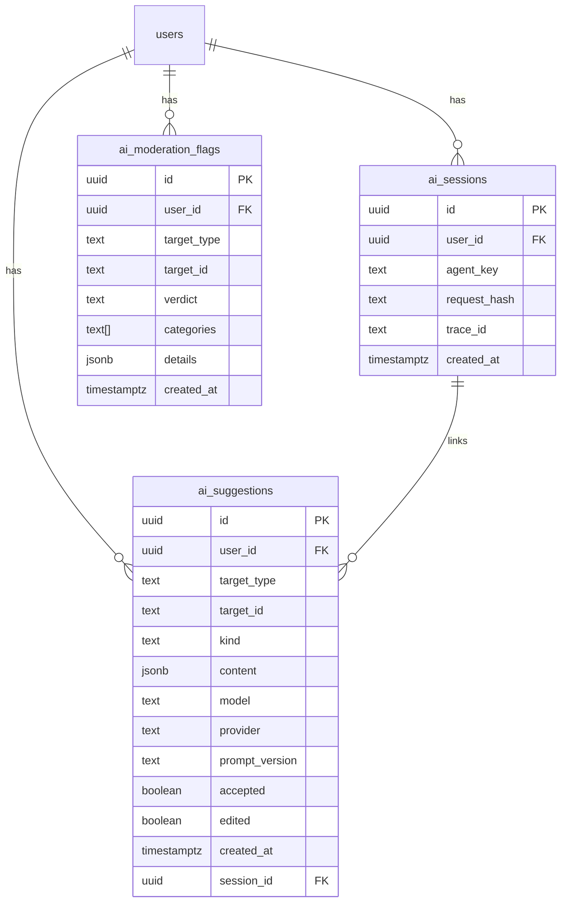

# AI Schema (Draft)

Este documento define las tablas propuestas para funcionalidades de IA en GoalShare. Es un borrador funcional para orientar futuras migraciones en Drizzle y decisiones de diseño. No se deben crear migraciones aún; primero validar este diseño.

## Objetivos

- **Trazabilidad y auditoría** de las sugerencias generadas por agentes.
- **Idempotencia y telemetría** a nivel de sesión/ejecución.
- **Moderación** pre/post generación para cumplimiento y seguridad.
- **Versionamiento** de prompts/modelos y medición de adopción (accepted/edited).

---

## Tablas

### 1) `ai_suggestions`

Registra salidas de los agentes para su auditoría, aceptación y mejora continua.

- `id` (uuid, pk)
- `user_id` (uuid, fk → `users.id` o equivalente en Supabase)
- `target_type` (text, enum lógico: `goal` | `milestone` | `post` | `comment`)
- `target_id` (uuid | text, id del recurso destino)
- `kind` (text, enum lógico: `milestones` | `smart` | `advice` | `plan`)
- `content` (jsonb, estructura tipada según DTO de cada endpoint)
- `model` (text, p.ej. `o4-mini`, `claude-3-5-sonnet`, `deepseek/deepseek-chat`)
- `provider` (text, p.ej. `openai` | `anthropic` | `openrouter`)
- `prompt_version` (text, versión de prompt utilizada)
- `accepted` (boolean, default false)
- `edited` (boolean, default false)
- `created_at` (timestamptz, default now())
- `session_id` (uuid, fk → `ai_sessions.id`, nullable)

Índices sugeridos:

- `idx_ai_suggestions_user_created_at` (user_id, created_at DESC)
- `idx_ai_suggestions_target` (target_type, target_id)
- `idx_ai_suggestions_kind` (kind)

Uso:

- Guardar el resultado generado antes de que el usuario lo acepte.
- Medir tasas de aceptación/edición por `prompt_version` y `model`.

---

### 2) `ai_sessions`

Representa una ejecución/orquestación de un agente (para idempotencia, cache y trazas).

- `id` (uuid, pk)
- `user_id` (uuid, fk → users)
- `agent_key` (text, enum lógico: `planner` | `smart` | `coach` | `scheduler` | `moderator`)
- `request_hash` (text, hash estable del input para cache/idempotency)
- `trace_id` (text, opcional, correlación con sistema de tracing)
- `created_at` (timestamptz, default now())

Índices sugeridos:

- `uniq_ai_sessions_request_hash` (unique)
- `idx_ai_sessions_user_created_at` (user_id, created_at DESC)

Uso:

- Evitar ejecuciones duplicadas.
- Auditar runs y correlacionar con logs externos.

---

### 3) `ai_moderation_flags`

Marca contenidos para revisión o bloqueo; puede aplicarse a entradas/salidas.

- `id` (uuid, pk)
- `user_id` (uuid, fk → users, opcional si el contenido no está ligado a usuario)
- `target_type` (text, `post` | `comment` | `goal` | `milestone` | `suggestion`)
- `target_id` (uuid | text)
- `verdict` (text, enum lógico: `allow` | `block` | `review`)
- `categories` (text[], categorías de incumplimiento o riesgo)
- `details` (jsonb, razones, extractos, puntuaciones)
- `created_at` (timestamptz, default now())

Índices sugeridos:

- `idx_ai_moderation_target` (target_type, target_id)
- `idx_ai_moderation_created_at` (created_at DESC)

Uso:

- Gatear publicación de posts/comentarios.
- Moderar sugerencias de IA antes de mostrarlas o persistirlas como definitivas.

---

## Relaciones

---

## Correspondencia con DTOs (resumen)

- `milestones` → `content.milestones: Milestone[]` (DTO de `/api/ai/milestones`).
- `smart` → `content: SmartResponse`.
- `advice` → `content: AdviceResponse`.
- `plan` → `content.schedule: DayBlock[]`.
- Moderación → flags vinculados a `target_type/target_id` o a `ai_suggestions` (cuando `target_type = 'suggestion'`).

---

## Estrategia de migración (cuando se apruebe)

1. Crear migraciones con Drizzle para las tres tablas, índices y FKs.
2. Actualizar `db/schema.ts` con los modelos Tipados.
3. Añadir repositorios ligeros para:
   - Insertar `ai_sessions` (con `request_hash`).
   - Insertar `ai_suggestions` (vinculadas a sesión si aplica).
   - Insertar `ai_moderation_flags`.
4. Añadir seeds opcionales mínimos para pruebas manuales.

---

## Privacidad y cumplimiento

- Evitar almacenar datos sensibles en `content`.
- Considerar redactar/anonimizar PII antes de persistir salidas.
- Mantener logs/trazas en conformidad con políticas de datos.

---

## Notas

- Este diseño permite **seguir siendo agnósticos del proveedor de LLM** y versionar prompts/modelos.
- `session_id` facilita correlación con caching, rate limit y tracing.
- `accepted`/`edited` abren la puerta a una **capa de calidad** (medir utilidad real de la IA).
