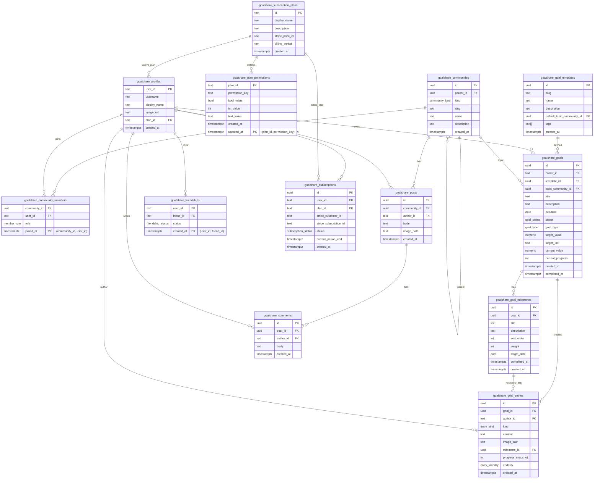

# GoalShare – Diagrama ER (Mermaid)

> Fuente: esquema actual en `db/schema.ts` (tablas prefijadas con `goalshare_`).

```mermaid
erDiagram
  goalshare_profiles {
    text user_id PK
    text username
    text display_name
    text image_url
    text plan_id FK
    timestamptz created_at
  }

  goalshare_subscription_plans {
    text id PK
    text display_name
    text description
    text stripe_price_id
    text billing_period
    timestamptz created_at
  }

  goalshare_plan_permissions {
    text plan_id FK
    text permission_key
    bool bool_value
    int int_value
    text text_value
    timestamptz created_at
    timestamptz updated_at
    PK "(plan_id, permission_key)"
  }

  goalshare_communities {
    uuid id PK
    uuid parent_id FK
    community_kind kind
    text slug
    text name
    text description
    timestamptz created_at
  }

  goalshare_community_members {
    uuid community_id FK
    text user_id FK
    member_role role
    timestamptz joined_at
    PK "(community_id, user_id)"
  }

  goalshare_goal_templates {
    uuid id PK
    text slug
    text name
    text description
    uuid default_topic_community_id FK
    text[] tags
    timestamptz created_at
  }

  goalshare_goals {
    uuid id PK
    text owner_id FK
    uuid template_id FK
    uuid topic_community_id FK
    text title
    text description
    date deadline
    goal_status status
    goal_type goal_type
    numeric target_value
    text target_unit
    numeric current_value
    int current_progress
    timestamptz created_at
    timestamptz completed_at
  }

  goalshare_goal_milestones {
    uuid id PK
    uuid goal_id FK
    text title
    text description
    int sort_order
    int weight
    date target_date
    timestamptz completed_at
    timestamptz created_at
  }

  goalshare_goal_entries {
    uuid id PK
    uuid goal_id FK
    text author_id FK
    entry_kind kind
    text content
    text image_path
    uuid milestone_id FK
    int progress_snapshot
    entry_visibility visibility
    timestamptz created_at
  }

  goalshare_posts {
    uuid id PK
    uuid community_id FK
    text author_id FK
    text body
    text image_path
    timestamptz created_at
  }

  goalshare_comments {
    uuid id PK
    uuid post_id FK
    text author_id FK
    text body
    timestamptz created_at
  }

  goalshare_friendships {
    text user_id FK
    text friend_id FK
    friendship_status status
    timestamptz created_at
    PK "(user_id, friend_id)"
  }

  goalshare_subscriptions {
    uuid id PK
    text user_id FK
    text plan_id FK
    text stripe_customer_id
    text stripe_subscription_id
    subscription_status status
    timestamptz current_period_end
    timestamptz created_at
  }

  %% Relaciones
  goalshare_communities ||--o{ goalshare_communities : parent
  goalshare_communities ||--o{ goalshare_community_members : has
  goalshare_profiles ||--o{ goalshare_community_members : joins

  goalshare_communities ||--o{ goalshare_posts : has
  goalshare_profiles ||--o{ goalshare_posts : writes

  goalshare_posts ||--o{ goalshare_comments : has
  goalshare_profiles ||--o{ goalshare_comments : writes

  goalshare_goal_templates ||--o{ goalshare_goals : defines
  goalshare_profiles ||--o{ goalshare_goals : owns
  goalshare_communities ||--o{ goalshare_goals : topic

  goalshare_goals ||--o{ goalshare_goal_milestones : has
  goalshare_goals ||--o{ goalshare_goal_entries : timeline
  goalshare_goal_milestones ||--o{ goalshare_goal_entries : milestone_link
  goalshare_profiles ||--o{ goalshare_goal_entries : author

  goalshare_profiles ||--o{ goalshare_friendships : links
  goalshare_profiles ||--o{ goalshare_subscriptions : has
  goalshare_subscription_plans ||--o{ goalshare_profiles : active_plan
  goalshare_subscription_plans ||--o{ goalshare_subscriptions : billed_plan
  goalshare_subscription_plans ||--o{ goalshare_plan_permissions : defines
```
