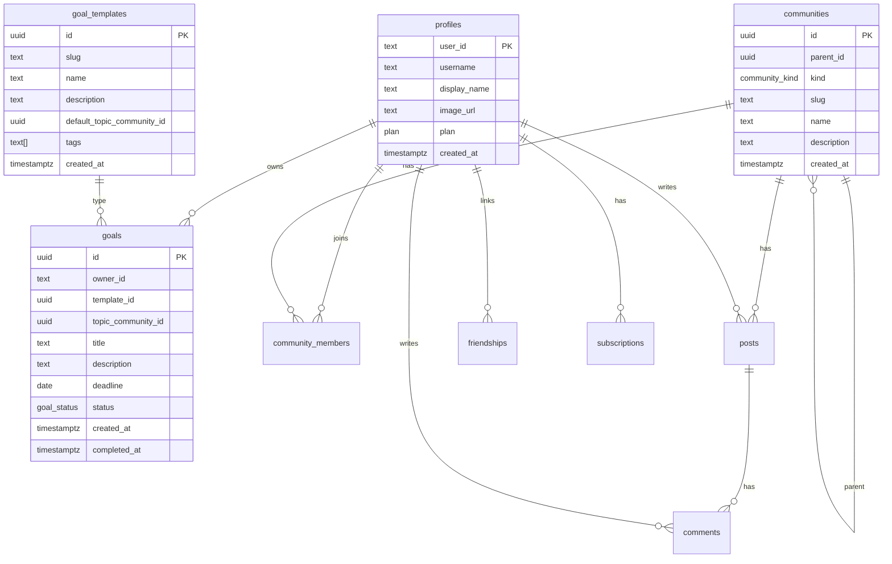

# GoalShare – Esquema de Base de Datos (Propuesta Final)

Este documento describe el modelo relacional propuesto para GoalShare, optimizado para:
- Clerk como identidad (usaremos `profiles.user_id` con el `clerk_user_id`).
- Postgres (Supabase) con RLS real y contexto de usuario.
- Drizzle ORM para definir el esquema y ejecutar migraciones (cuando corresponda).
- Comunidades jerárquicas (Domain → Topic → Cohort) y plantillas de metas para mapeo automático.

## Enfoque de Autenticación y RLS
- Clerk gestiona la identidad. En Postgres no tenemos `auth.uid()`, por lo que proponemos:
  - Establecer por conexión una variable `app.user_id = '<clerk_user_id>'` mediante `set_config` desde el servidor (Next.js server actions/route handlers) en cada request autenticada.
  - Las políticas RLS referencian `current_setting('app.user_id', true)` para identificar al usuario.

## Enums
- `plan`: `free` | `premium`
- `community_kind`: `domain` | `topic` | `cohort`
- `goal_status`: `pending` | `completed`
- `member_role`: `member` | `admin`
- `friendship_status`: `pending` | `accepted` | `blocked`
- `subscription_status`: `active` | `past_due` | `canceled` | `incomplete` | `trialing`
- `entry_kind`: `progress` | `note` | `tip` | `checkin` | `milestone_update`
- `entry_visibility`: `private` | `friends` | `public`

## Tablas

### profiles
- `user_id` text PK (Clerk user id)
- `username` text unique
- `display_name` text
- `image_url` text
- `plan` plan not null default `free`
- `created_at` timestamptz not null default now()
- Índices: unique(`username`)

### communities (jerárquica Domain → Topic → Cohort)
- `id` uuid PK default gen_random_uuid()
- `parent_id` uuid null FK → communities.id
- `kind` community_kind not null
- `slug` text unique not null (ej: `languages`, `languages-english`)
- `name` text not null
- `description` text null
- `created_at` timestamptz not null default now()
- Índices: unique(`slug`), index(`parent_id`), index(`kind`)

### community_members
- `community_id` uuid not null FK → communities.id
- `user_id` text not null FK → profiles.user_id
- `role` member_role not null default `member`
- `joined_at` timestamptz not null default now()
- PK (`community_id`, `user_id`)
- Índices: index(`user_id`)

### goal_templates (plantillas de metas)
- `id` uuid PK default gen_random_uuid()
- `slug` text unique not null (ej: `learn-english`, `run-10k`)
- `name` text not null
- `description` text null
- `default_topic_community_id` uuid not null FK → communities.id (kind=topic)
- `tags` text[] null
- `created_at` timestamptz not null default now()
- Índices: unique(`slug`), index(`default_topic_community_id`)

### goals
- `id` uuid PK default gen_random_uuid()
- `owner_id` text not null FK → profiles.user_id
- `template_id` uuid null FK → goal_templates.id
- `topic_community_id` uuid not null FK → communities.id (kind=topic)
- `title` text not null
- `description` text not null
- `deadline` date null
- `status` goal_status not null default `pending`
- `created_at` timestamptz not null default now()
- `completed_at` timestamptz null
- Índices: index(`owner_id`, `status`, `created_at`), index(`topic_community_id`, `created_at`)

### goal_milestones (hitos de meta)
- `id` uuid PK default gen_random_uuid()
- `goal_id` uuid not null FK → goals.id
- `title` text not null
- `description` text null
- `sort_order` int not null default 0
- `target_date` date null
- `completed_at` timestamptz null
- `created_at` timestamptz not null default now()
- Índices: index(`goal_id`, `sort_order`), index(`goal_id`, `completed_at`)

### goal_entries (timeline de progreso/notas/tips)
- `id` uuid PK default gen_random_uuid()
- `goal_id` uuid not null FK → goals.id
- `author_id` text not null FK → profiles.user_id
- `kind` entry_kind not null
- `content` text null
- `progress_value` int null (0–100)
- `metric_value` numeric null
- `metric_unit` text null (ej: `km`, `h`)
- `image_path` text null (Supabase Storage)
- `milestone_id` uuid null FK → goal_milestones.id
- `visibility` entry_visibility not null default `private`
- `created_at` timestamptz not null default now()
- Índices: index(`goal_id`, `created_at`), index(`milestone_id`, `created_at`), index(`author_id`, `created_at`)

### posts
- `id` uuid PK default gen_random_uuid()
- `community_id` uuid not null FK → communities.id
- `author_id` text not null FK → profiles.user_id
- `body` text not null
- `image_path` text null (Supabase Storage)
- `created_at` timestamptz not null default now()
- Índices: index(`community_id`, `created_at`), index(`author_id`, `created_at`)

### comments
- `id` uuid PK default gen_random_uuid()
- `post_id` uuid not null FK → posts.id
- `author_id` text not null FK → profiles.user_id
- `body` text not null
- `created_at` timestamptz not null default now()
- Índices: index(`post_id`, `created_at`), index(`author_id`, `created_at`)

### friendships (amistades)
- `user_id` text not null FK → profiles.user_id
- `friend_id` text not null FK → profiles.user_id
- `status` friendship_status not null default `pending`
- `created_at` timestamptz not null default now()
- Constraints:
  - Check `user_id <> friend_id`
  - UNIQUE (LEAST(user_id, friend_id), GREATEST(user_id, friend_id))
- Índices: index(`user_id`), index(`friend_id`)

### subscriptions (suscripciones Stripe)
- `id` uuid PK default gen_random_uuid()
- `user_id` text not null FK → profiles.user_id
- `stripe_customer_id` text not null
- `stripe_subscription_id` text not null unique
- `status` subscription_status not null
- `current_period_end` timestamptz not null
- `created_at` timestamptz not null default now()
- Índices: index(`user_id`), index(`status`)

## Relaciones (diagrama lógico)

## Reglas de Negocio Clave
- **Límite de 5 metas (Free):** validar inicialmente desde la app; opcionalmente reforzar con trigger/policy.
- **Comentarios:**
  - Free: solo comentar en posts de amigos.
  - Premium: comentar en cualquier post.
- **Visibilidad de entradas (`goal_entries.visibility`):** `private` | `friends` | `public`.
- **Mapeo de metas a comunidades:** via `goal_templates.default_topic_community_id`.

## RLS (resumen recomendado)
- `profiles`: SELECT básico; UPDATE solo dueño (`app.user_id = user_id`).
- `goals`, `goal_milestones`: dueño total (I/U/D/SELECT del owner).
- `goal_entries`: INSERT dueño; SELECT según `visibility` (dueño siempre, amigos si `friends`, público si `public`).
- `communities`: SELECT público; I/U limitado a admins (etapa posterior).
- `community_members`: INSERT/DELETE propio (join/leave); admin puede gestionar miembros.
- `posts`: INSERT si miembro; UPDATE/DELETE autor o admin; SELECT miembros (o público si decides).
- `comments`: INSERT si premium o amistad aceptada con autor del post; UPDATE/DELETE autor o admin.
- `friendships`: solo involucrados.
- `subscriptions`: dueño y service role (webhooks Stripe).

## Índices Sugeridos
- `goals(owner_id, status, created_at)`
- `posts(community_id, created_at)`
- `comments(post_id, created_at)`
- `friendships(user_id, friend_id)`
- `community_members(community_id, user_id)`
- Uniques: `communities.slug`, `profiles.username`, combinación simétrica en `friendships`.

## Próximos Pasos
- Implementar este esquema en `db/schema.ts` con Drizzle (sin migraciones por ahora).
- Preparar helper de contexto de usuario (Clerk → Postgres): `set_config('app.user_id', ...)`.
- Una vez aprobado el esquema, generar migraciones con `bun run db:generate` y aplicarlas con `bun run db:migrate`.
